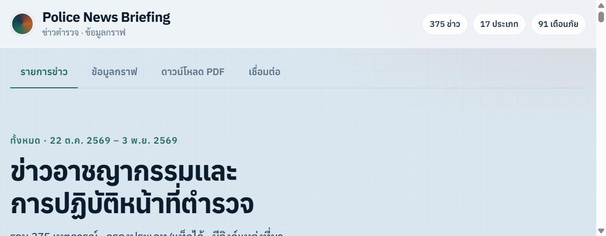
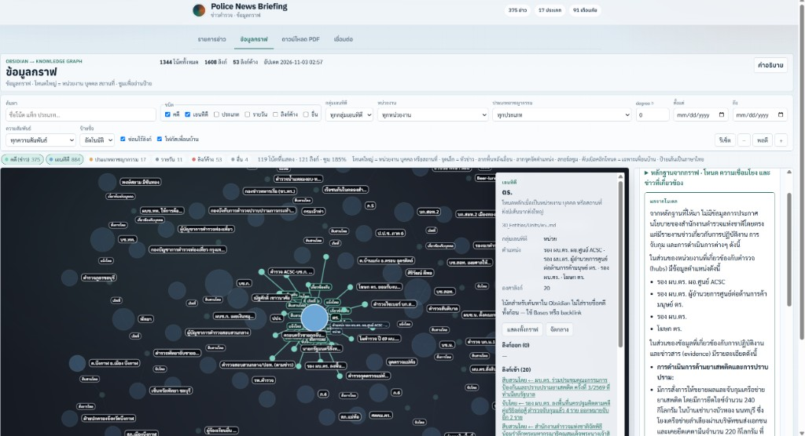
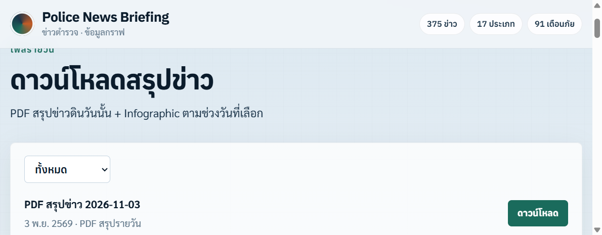
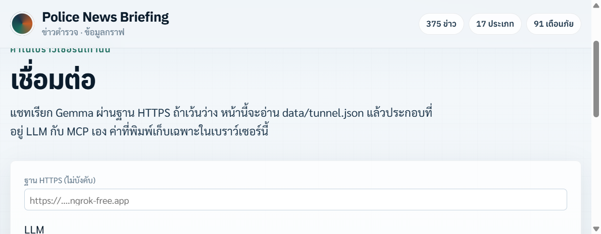

# ข่าวตำรวจ

ข่าวอาชญากรรมรายวันบน GitHub Pages

เว็บ: https://chiraleo2000.github.io/Police-news-intel-kit/

| มุมมอง | ที่อยู่ |
| --- | --- |
| ข่าวทั้งหมด | `#/r/all` |
| ข่าวย้อนหลัง | `#/r/1` `#/r/3` `#/r/7` `#/r/14` `#/r/30` `#/r/90` |
| ข่าวหนึ่งเรื่อง | `#/{วันที่}/{รหัสเรื่อง}` |
| ข้อมูลกราฟ | `#/brain` |
| ดาวน์โหลด | `#/downloads/r/all` |
| เชื่อมต่อ LLM | `#/connect` |

---

## หน้า GitHub Pages ใช้อย่างไร

เว็บนี้เป็นหน้าอ่านอย่างเดียว ข้อมูลมาจาก workspace ผลิตข่าว **`police-news-intel-private`** ทุกเช้า/บ่าย

### 1) รายการข่าว

- กรองประเภทอาชญากรรม ช่วงวัน แท็ก หรือค้นหาหน่วยงาน/จังหวัด
- เปิดหัวข่าวเพื่ออ่านสรุป การวิเคราะห์ และความเชื่อมโยงกับคดีอื่น
- ตัวเลขบนหัวเว็บแสดงจำนวนข่าว ประเภท และรายการเตือนภัยในคลังปัจจุบัน

### 2) ข้อมูลกราฟ

- โหนดใหญ่ = หน่วยงาน บุคคล สถานที่ · จุดเล็ก = หัวข่าว
- คลิกโหนดเพื่อเปิดแผงรายละเอียด (path, กลุ่มเอนทิตี, ตำแหน่ง, ลิงก์เข้า/ออก)
- คอลัมน์ขวาเป็น **ถามจากกราฟ**: ค้นหลักฐานจากกราฟก่อน แล้วให้โมเดลเขียนสรุปท้ายสุด
- ชื่อหน่วยงานซ้ำ (เช่น `สำนักงานตำรวจแห่งชาติ` / `ตร.`) ถูกรวมเป็นโหนดมาตรฐานจาก Task 3 ใน private ก่อน publish

### 3) ดาวน์โหลด PDF

- เลือกช่วงวัน แล้วดาวน์โหลด PDF สรุปรายวันและ Infographic
- ไฟล์อยู่ใต้ `github-pages/data/downloads/`

### 4) เชื่อมต่อ (แชทจากกราฟ)

- ถ้าเว้นว่าง หน้าเว็บอ่าน `data/tunnel.json` แล้วประกอบที่อยู่ LLM / MCP เอง
- โมเดลค่าเริ่มต้น: `google/gemma-4-e2b`
- ใช้เมื่อต้องการให้แท็บข้อมูลกราฟเรียกโมเดลผ่าน ngrok ของเครื่องที่รัน LM Studio

---

## สองบทบาทของ repo นี้

### 1) Static GitHub Pages (หลัก)

โฟลเดอร์ `github-pages/` คือเว็บอ่านอย่างเดียว ซิงค์มาจาก **`police-news-intel-private`**

- คน/CI ใน private เป็นคน publish เข้า repo นี้
- ไม่มี `prompts/`, `server/`, `vault/`, หรือสคริปต์ rebuild ใน public — ไปป์ไลน์อยู่ที่ private เท่านั้น

### 2) Optional local RAG (เสริม)

ถ้าต้องการแชทจากกราฟบนเครื่อง ให้รัน tunnel ของ kit นี้ผ่าน `ops/wake-tunnel.ps1` (อ่าน `ops/tunnel.config.json`):

| บริการ | พอร์ต |
| --- | --- |
| MCP | `:8787` |
| Gateway | `:8790` |
| LM Studio | `:1234` |

จากนั้นสคริปต์เขียน `github-pages/data/tunnel.json` ให้หน้า Pages เรียก chat ได้

**หลัง hibernate / wake:** task `PoliceNewsWakeTunnel` รันตอน resume (หน่วง ~90 วินาทีให้เน็ตพร้อม) และ `PoliceNewsLmsWatch` ตรวจทุก 5 นาทีแบบ `-Watch` — ไม่ใช่แค่โหลด Gemma แต่ซ่อม gateway / MCP / อุโมงค์ RAG และอัปเดต `tunnel.json` ถ้า URL เปลี่ยน

**แยกจาก LINE / tor:** wake-tunnel จัดการเฉพาะ tunnel ของ RAG (`:8790`) — recycle เฉพาะ agent ของ RAG เท่านั้น, ไม่แตะพอร์ต `:18080`, ไม่แตะ `ngrok-line.log`, ไม่ใช้โดเมน `fresh-currently-elk.ngrok-free.app`, และไม่แก้ไฟล์ใน `police-news-intel-private`

ดูรายละเอียดหน้าเว็บใน [`github-pages/README.md`](github-pages/README.md)
